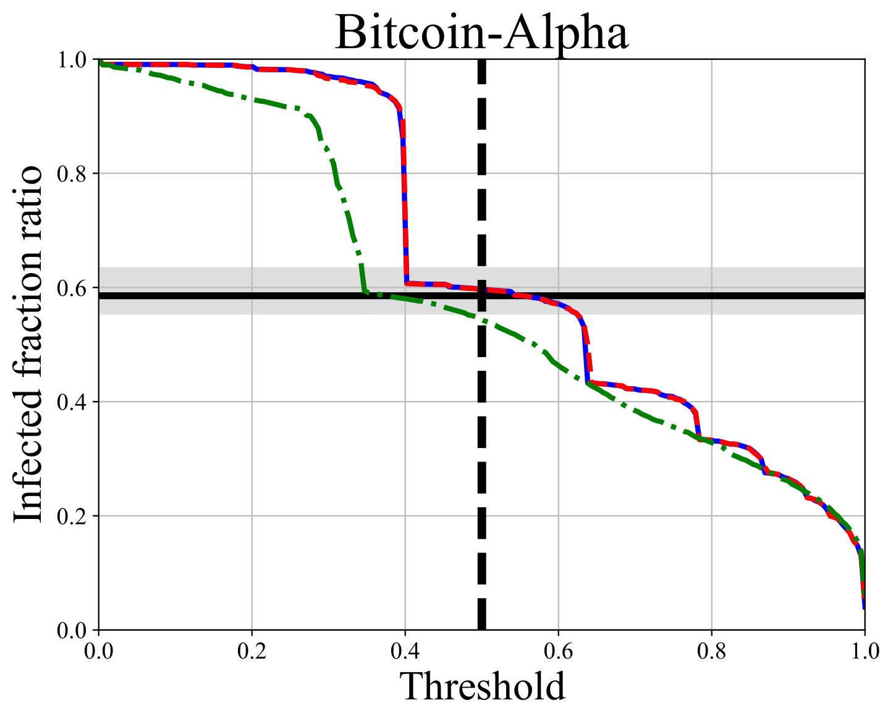

# Probabilistic Disease Spread on Directed Graph

This code is for paper *Probabilistic Disease Spread on Directed Graphs: Approximation
and Acceleration*, which investigates the probabilistic spread of epidemics on directed graphs and derives the steady-state distribution for each individual in the network. Our goal is to demystify the spread process and **accelerate the entire process**. For simplicity, the epidemic spread is modeled using the SIR framework, with Monte Carlo simulations serving as ground truth.

## Evironment Setting

First create and activate the virtual evironment:

```bash
conda create -n epidemics python==3.10

source activate epidemics
```


Run the following to install dependencies:

```bash
pip install -r requirements.txt
```

## Arguments

Here is a table of the argument parameters for the SIR model simulation:

| Argument | Default | Description                                         |
|----------|---------|-----------------------------------------------------|
| `--graph_type` | `"powerlaw"` | Graph type                                          |
| `--nodes` | `10000` | Number of nodes in the graph                        |
| `--average_degree` | `5` | Average degree of the graph                         |
| `--beta` | `1/18` | Infection rate                                      |
| `--gamma` | `1/9` | Recovery rate                                       |
| `--tol` | `1e-3` | Tolerance for convergence                           |
| `--num_simulations` | `50` | Number of Monte Carlo simulations                   |
| `--mc_batch_size` | `20` | Batch size of Monte Carlo simulations               |
| `--initial_infected_ratio` | `0.01` | Ratio of initially infected nodes in the population |
| `--top_k_ratio` | `0.1` | Top-K ratio for overlap calculation                 |
| `--omega` | `1.3` | Relaxation coefficient for Relaxation-PDS           |
| `--p` | `10` | Number of pre-heat steps in LocalPush-PDS           |
| `--data_dir` | `"./data"` | Directory to load real data                         |
| `--file_name` | `""` | File name of the real data                          |
| `--output_dir` | `"./output"` | Directory to save results                           |

### Notes:
- The choices for `--graph_type` are: `ba`, `er`, `powerlaw`, `smallworld`.
- The choices for `--file_name` are `soc-sign-bitcoinalpha.csv.gz`, `soc-sign-bitcoinotc.csv.gz`, `p2p-Gnutella31.txt.gz` `email-Enron.txt.gz`, `email-EuAll.txt.gz`, `soc-sign-epinions.csv.gz`, `soc-sign-slashdot.csv.gz`, `soc-pokec-relationships.txt.gz`. If you want to run synthetic data, leave `--file_name` **empty**. Before you run real datasets, please download the datasets from [SNAP](https://snap.stanford.edu/data/index.html) and put them in the `data` directory.


## Usage
If you want to run the simulation with default parameters, simply run 

```bash
python main.py
```

If you want to run real datasets, you can specify the `--file_name` argument. For example, to run the Bitcoin-Alpha dataset, run

```bash
python main.py --file_name=soc-sign-bitcoinalpha.csv.gz --initial_infected_ratio=0.01
```

If you want to run synthetic data, you can specify the `--graph_type` argument. For example, to run the Erdos-Renyi graph, run

```bash
python main.py --graph_type=er --nodes=10000 --average_degree=5
```

## Expected Output
After running `main.py`, there will be a folder name after timestamp in the `output` directory. The folder contains the following files:

1. `arg_settings.csv`: Configuration file for the simulation.
```
Argument,Value
graph_type,
nodes,3783
average_degree,6.393338620142744
beta,0.05555555555555555
gamma,0.1111111111111111
tol,0.001
num_simulations,50
mc_batch_size,20
initial_infected_ratio,0.01
top_k_ratio,0.1
omega,1.3
p,10
data_dir,./data
file_name,soc-sign-bitcoinalpha.csv.gz
output_dir,./output
```

2. `mc_summary.csv`: Metrics for the simulation.
```
Metric,Value
Mean S,1568.0600
Lower Bound (2.5%),1383.4500
Upper Bound (97.5%),1687.3250
MC Runtime (s),12.8306
MC Iterations,84.3800
```

3. `centralities.csv`: Performance for centralities as baseline.
```
Degree,Eigenvector,PageRank,Betweenness,Closeness
Kendall Tau,0.7344,0.5242,0.0203,0.6124,0.5460
Top-K Overlap,0.8228,0.7804,0.0132,0.6667,0.6878
```

4. `PDS_summary.csv`: Performance for PDS.
```
Method,Runtime (s),Kendall Tau,Top-K Overlap
PDS,1.6282,0.8092,0.8915
```

5. `Relaxation-PDS_summary.csv`: Performance for Relaxation-PDS.
```
Method,Runtime (s),Kendall Tau,Top-K Overlap
Relaxation-PDS,1.3387,0.7936,0.8386
```

6. `LocalPush-PDS_summary.csv`: Performance for LocalPush-PDS.
```
Method,Runtime (s),Kendall Tau,Top-K Overlap
LocalPush-PDS,0.6406,0.7798,0.8280
```

7.`mc_baselines_vs_curves.csv`: Comparison between Monte Carlo simulations and approximations.

[//]: # ()
{ width=300 }